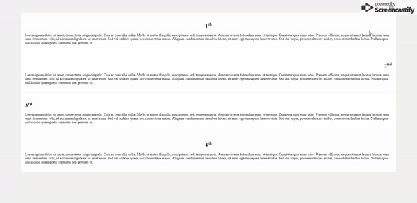

# Basic Intro JS (Beta)

With **this javascript plugin** you will be able to add comments to your projects. Very simple to use **:)**

## Configuration

1. Add the javascript and css file to html. Please note that your intro javascript file is at the top of your javascript file!
2. Get a new instance in your file.
    > const  intro = new  Intro();
3. Use the **config function** to make your intro settings.

        intro.config({
            nextText: 'İleri <i class="fas fa-chevron-right"></i>',
            prevText: '<i class="fas fa-chevron-left"></i> Geri',
            skipText: 'Introyu Geç',
            finishText: 'Bitir <i class="fas fa-check"></i>',
            intros:[
                {
                    element: '#first',
                    text: 'Lorem ipsum dolor sit amet, consectetur adipiscing elit. Cras ac convallis nulla. Morbi ut metus fringilla, suscipit nisi sed, tempus mauris.',
                    position: 'bottom'
                },
                {
                    element: '#second',
                    text: 'Lorem ipsum dolor sit amet, consectetur adipiscing elit. Cras ac convallis nulla. Morbi ut metus fringilla, suscipit nisi sed, tempus mauris. Aenean viverra bibendum nunc et tristique. Curabitur quis enim odio. Praesent efficitur, neque sit amet lacinia lacinia, urna urna fermentum velit, id accumsan ligula ex sit amet enim.',
                    position: 'left'
                },
                {
                    element: '#third',
                    text: ' Sed vel sodales quam, nec consectetur massa.',
                    position: 'right'
                },
                {
                    element: '#fourth',
                    text: 'Aenean viverra bibendum nunc et tristique. Curabitur quis enim odio. Praesent efficitur, neque sit amet lacinia lacinia, urna urna fermentum velit, id accumsan ligula ex sit amet enim. Sed vel sodales quam, nec consectetur massa.',
                    position: 'top'
                }
            ]
        });

    ### Config Params

    |Params|Description  |
    |--|--|
    | **nextText** | Must be **String**. Text on next button. Html can be written. **Default**: Next |
    | **skipText**| Must be **String**. Text on skip button. Html can be written. **Default**: Skip|
    | **prevText** | Must be **String**. Text on previous button. Html can be written. **Default**: Previous|
    | **finishText**| Must be **String**. Text on finish button. Html can be written. **Default**: Finish|
    | **intros** | Must be **Array**. **Mandatory!**|

     #### Intros Params

    |Params|Description  |
    |--|--|
    | **element** | Must be **String**. The future element of intro. **Mandatory!**|
    | **text** | Must be **String**. Intro will also write text. **Mandatory!**|
    | **position** | Must be **String**. **top**-**bottom**-**left**-**right** params. |

## Other Function

|Function|Description  |
|--|--|
| **start()** | Initiates intro. The default value is 1. The value entered represents the intro to be started. **If more than the intros length is entered, starts from 1.** |
| **removeIntroBox()** | Delete the intro box and the scroll remains the same. |
| **removeIntro()** | Delete the intro box and scrolls to the top. |
| **setScroll** | Scrolls according to the given height value. |

## Keyboard Shortcuts
 > The keyboard functions after the intro is opened.

|Shortcut|Description  |
|--|--|
| **ESC** | Turns off intro. |
| **Right** | Intro goes to the next step. |
| **Left** | Intro goes to the previous step. |
